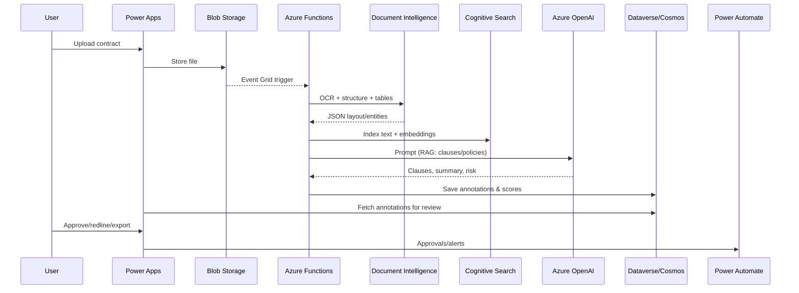

# Glean by AtosSyntinels — AI Legal Document Intelligence

TL;DR: Glean automates contract understanding with AI. It ingests legal documents, classifies clauses, generates summaries, scores risks, and orchestrates human-in-the-loop review using a low-code/no-code experience built on Power Platform and Azure.

## Problem
Legal teams spend hours reading, annotating, and comparing contracts. Manual review is slow, inconsistent, and hard to scale across business units and jurisdictions.

## Solution Overview
Glean is an AI-powered platform for contract and legal text intelligence that:
- Categorizes and annotates clauses (e.g., Termination, Indemnity, Confidentiality)
- Generates concise, audience-specific summaries
- Assesses risk against configurable playbooks and fallback language
- Supports approvals, redlining suggestions, and exception handling
- Integrates into enterprise workflows via Power Platform and APIs

## Key Features
- Clause detection and taxonomy mapping
- Risk scoring with configurable policy packs per industry/geography
- Summarization at document, section, and clause granularity
- RAG-based grounding on internal playbooks and precedent repository
- Human-in-the-loop: review, override, and feedback learning
- Multi-format ingestion: PDF, DOCX, images, emails
- Power Apps UI + Power Automate workflows + Power BI dashboards
- Enterprise controls: audit, RBAC, data residency, encryption, traceability

## Reference Architecture (Azure + Power Platform)

```mermaid
graph TD
  U[User (Legal/Procurement)] -->|Upload/Review| PA[Power Apps (Canvas/App)]
  PA -->|Documents| B[(Azure Blob Storage)]
  B --> EG[Event Grid]
  EG --> FN[Azure Functions (Orchestrator)]
  FN --> DI[Azure AI Document Intelligence (OCR/Layout/Form Recognizer)]
  FN --> CS[Azure Cognitive Search (Index + Vectors)]
  FN --> LLM[Azure OpenAI / Azure AI Studio Models]
  LLM --> KV[Azure Key Vault]
  CS --> LLM
  FN --> DB[(Cosmos DB/Postgres)]
  FN --> DV[Dataverse]
  FN --> API[API Management]
  API --> APP[App Service/Containers]
  DV --> PBI[Power BI]
  PA --> FL[Power Automate (Approvals/Notifications)]
  SUB[Playbooks/Policies/Precedents] --> CS
  MON[App Insights/Log Analytics] -->|Observability| FN
  KV --> FN
```

## Processing Flow



## Components
- Ingestion: Power Apps file upload to Azure Blob; email/dropbox connector optional
- OCR/Layout: Azure AI Document Intelligence for text, tables, signatures, entities
- Indexing: Azure Cognitive Search with vector embeddings for RAG over playbooks, SOPs, precedents
- NLP Models: Azure OpenAI GPT-4o family; optional fine-tuned classifiers for clause taxonomy and risk labels
- Orchestration: Azure Functions durable workflows; Logic Apps for integrations
- Storage: Dataverse for app data and approvals; Cosmos DB/Postgres for AI outputs and metadata
- APIs: API Management + App Service for secure access; Microsoft Graph/SharePoint connectors for source/target systems
- Security: Key Vault for secrets; Private Endpoints; Managed Identities; Customer-managed keys; Content Safety
- Observability: Application Insights, Log Analytics, Prompt traces and evaluation telemetry

## Agentic AI Capabilities
- Tools: search_precedent, fetch_policy, compute_risk, draft_redlines, extract_clauses, generate_summary
- Planner: decomposes objectives (e.g., "review MSA") into tool calls
- Memory: stores past decisions for specific counterparties and templates
- Guardrails: schema-constrained outputs, safety filters, and policy checks

## Intelligent UX (Low-code/No-code)
- Power Apps: review workspace, clause sidebar, risk heatmap, redline suggestions, export to DOCX/PDF
- Power Automate: approval paths, notifications in Teams/Outlook, SLA timers
- Power BI: portfolio risk dashboards, supplier trends, turnaround KPIs
- Configuration UI: upload playbooks, set risk thresholds, jurisdiction toggles

## Uniqueness and Atos Delivery Excellence
- Reusable accelerators: clause taxonomy, policy packs, prompt library, Azure IaC blueprints
- Secure-by-design: landing zone alignment, data residency, isolation, and RBAC
- MLOps best practices: evaluation suites, drift monitoring, prompt/version registry
- Industry packs: BFSI, Healthcare, Manufacturing, Public Sector templates
- Scale and reuse: modular APIs and connectors for rapid client deployments

## Setup (Reference)
Prereqs: Azure subscription, Power Platform environment, Azure OpenAI access, Azure AI Document Intelligence.

1) Provision core resources (recommended: IaC)
- Resource Group, Storage (Blob), Key Vault, App Insights
- Azure OpenAI (model: gpt-4o-mini or latest compliant), Cognitive Search (vector)
- Document Intelligence (latest GA), Functions, API Management, Dataverse environment

2) Index playbooks/precedents
- Upload documents to `playbooks` container
- Run indexing function to create text + vector embeddings in Cognitive Search

3) Deploy Power Apps app and flows
- Import the provided solution package (to be added)
- Configure connections: Dataverse, Functions, Approvals, Teams

4) Configure secrets
- Store keys in Key Vault; enable managed identities on Functions and App Service

5) Test run
- Upload a sample contract; verify annotations, summary, and risk; run an approval

## Demo Script (≤3 minutes)
1. Upload a contract in Power Apps; show instant extraction
2. Auto-annotated clauses and risk heatmap appear
3. Open clause details; show grounded explanation and precedent links
4. Trigger approval; Teams notification and approval outcome
5. Export annotated summary and redlines to DOCX/PDF

## Deliverables
- Working app link (Power Apps) or recorded walkthrough
- Short demo video (≤3 min)
- Screenshots with explanation
- Architecture diagrams (above) and solution one-pager
- Model cards, prompt samples, and evaluation metrics

## Security, Compliance, and Governance
- Data encryption at rest and in transit; Customer-managed keys in Key Vault
- Private networking and managed identities; PII minimization; logging redaction
- Prompt/response audit trails and approver attribution
- Region pinning for data residency; retention policies

## Evaluation and KPIs
- Turnaround time reduction (TAT): target 60–80%
- Reviewer throughput: +3–5x
- Agreement to policy match rate: >90%
- False positive/negative on clause detection: <5–10% after tuning
- Human override rate trending down with feedback learning

## Roadmap
- Multi-language support and cross-jurisdiction packs
- Playbook authoring with versioning and A/B policy testing
- Redlining suggestions with structured deltas and tracked changes
- Deeper integrations: SAP Ariba, ServiceNow Source-to-Contract, Salesforce

## Repository Structure (planned)
- `infra/` IaC templates (Bicep/Terraform)
- `functions/` Azure Functions for orchestration and RAG
- `power/` Power Apps solution and Power Automate flows
- `prompts/` prompt templates and evaluation
- `docs/` architecture, policies, and screenshots

## License
TBD

