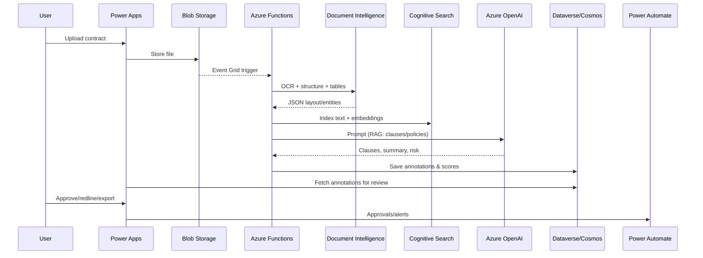

# Glean Architecture

This document complements the root README with focused architecture details.

## Reference Architecture

```mermaid
graph TD
  U[User (Legal/Procurement)] -->|Upload/Review| PA[Power Apps (Canvas/App)]
  PA -->|Documents| B[(Azure Blob Storage)]
  B --> EG[Event Grid]
  EG --> FN[Azure Functions (Orchestrator)]
  FN --> DI[Azure AI Document Intelligence]
  FN --> CS[Azure Cognitive Search]
  FN --> LLM[Azure OpenAI / Azure AI Studio Models]
  LLM --> KV[Azure Key Vault]
  CS --> LLM
  FN --> DB[(Cosmos DB/Postgres)]
  FN --> DV[Dataverse]
  FN --> API[API Management]
  API --> APP[App Service/Containers]
  DV --> PBI[Power BI]
  PA --> FL[Power Automate]
  SUB[Playbooks/Policies/Precedents] --> CS
  MON[App Insights/Log Analytics] -->|Observability| FN
  KV --> FN
```

## Processing Flow



## Data Model (high level)
- Document: id, title, source, uploadUser, storageUri, status
- Clause: id, documentId, type, text, confidence, citations
- Risk: id, documentId, score, rationale, policyMatches, severity
- Summary: id, documentId, executive, legal, procurement
- Review: id, documentId, reviewer, action, comments, timestamp


